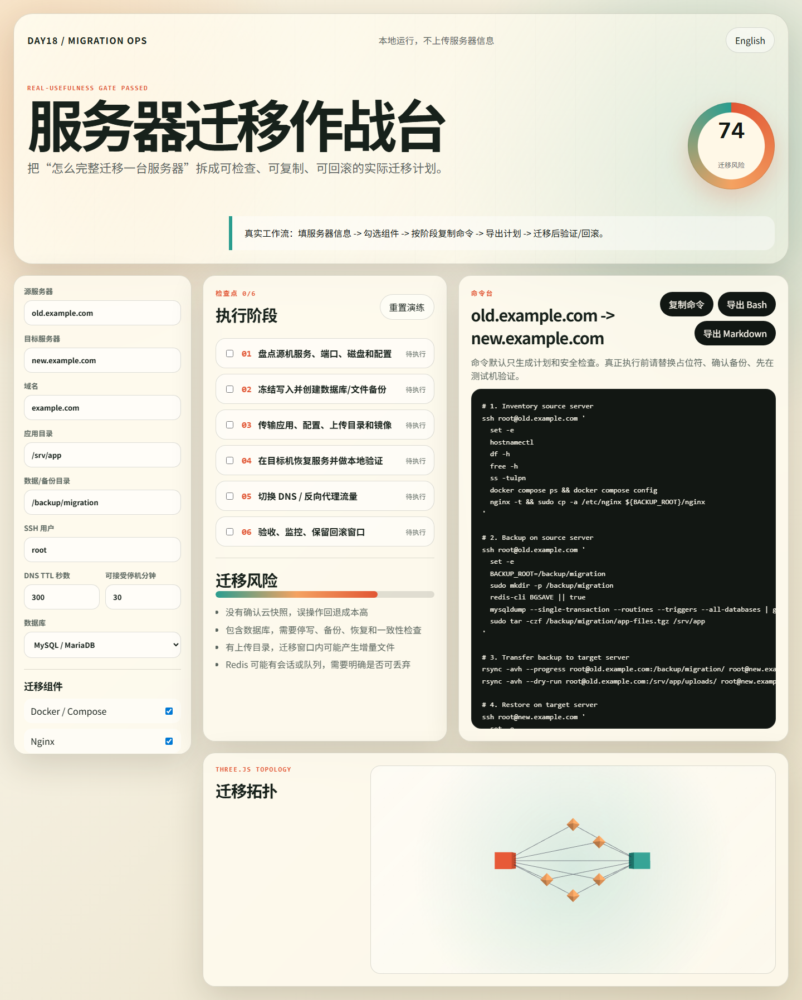
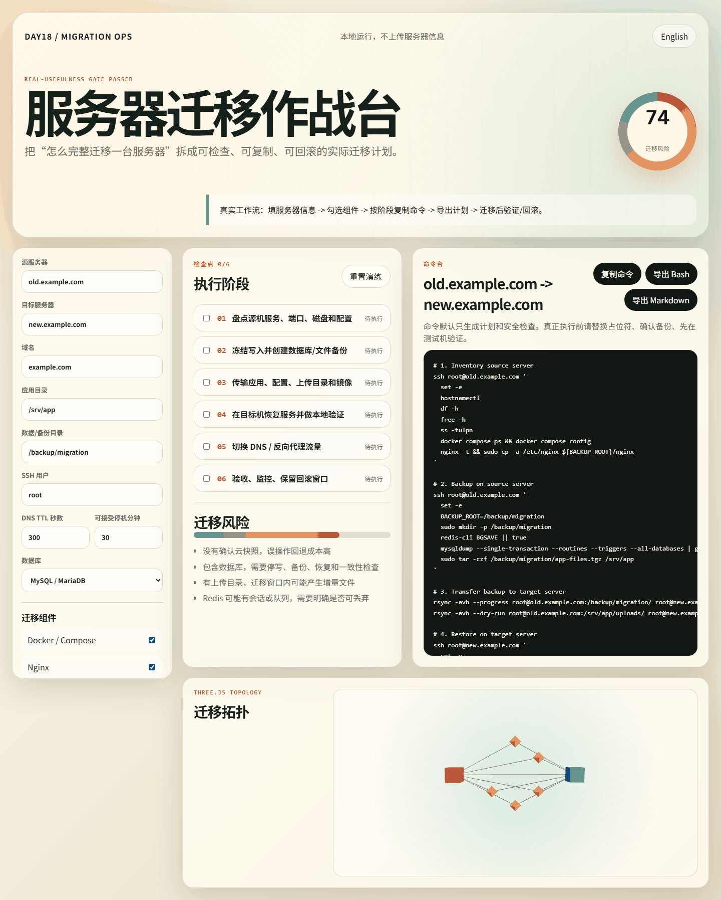

# Server Migration Command Deck

GitHub Pages: https://lxiaonan.github.io/server-migration-command-deck-day18/

## 中文介绍

### 这是什么

服务器迁移作战台是一个本地运行的迁移规划工具，适合正在把 VPS、云服务器、Docker 应用、Nginx、数据库和上传目录迁移到新机器的人。它把“怎么完整迁移一台服务器”拆成可检查阶段、风险提示、可复制 Bash 命令、回滚窗口和 Markdown / Bash 导出。

### 创新点

- 不是普通清单页，而是把迁移输入、风险分、执行阶段、命令生成、导出和 three.js 拓扑图放在同一个工作流里。
- 所有计算和命令生成都在浏览器本地完成，不上传服务器地址、路径或域名。
- three.js 拓扑图会根据 Docker、Nginx、数据库、上传目录等选择实时变化，用来辅助理解迁移链路，而不是装饰。

### 灵感来源

- 2026-05-19 同日调研：linux.do 上出现“如何完整迁移一台服务器”这类实际求助，核心痛点是迁移步骤零散、备份/回滚/切 DNS 容易漏。
- 2026-05-19 同日调研：掘金上持续有 Docker、Nginx、MySQL、rsync、服务器迁移相关实践文章，说明迁移操作是开发者和站长反复遇到的真实工作流。

### 预览





### 功能

- 填写源服务器、目标服务器、域名、应用路径、备份目录、SSH 用户、DNS TTL、可接受停机时间。
- 勾选 Docker、Nginx、Redis、上传目录、云快照、数据库类型后实时生成风险分和风险原因。
- 按 6 个阶段生成迁移计划：盘点、备份、传输、恢复、切换、验证。
- 生成可复制 Bash 命令，并支持导出 `migration-plan.sh` 和 `migration-plan.md`。
- 支持本地进度勾选和浏览器 localStorage 自动保存。
- 使用 three.js 展示迁移拓扑，组件选择变化时拓扑同步变化。

### 真实可用性说明

- 当前真正可用的核心能力：浏览器内生成服务器迁移清单、风险提示、命令脚本、Markdown 计划和 three.js 拓扑。
- 没有伪装成自动登录服务器的工具。它不会替你直接执行高风险命令，而是生成可检查、可复制、可保存的迁移作战文档。
- 不依赖大模型、付费 API 或后端服务；所有逻辑都在前端本地运行。

### 真实用户工作流

1. 打开 GitHub Pages 网站。
2. 填写源服务器、目标服务器、域名、应用路径和备份目录。
3. 勾选实际组件，例如 Docker、Nginx、MySQL、Redis、上传目录和是否已有快照。
4. 查看风险分和风险原因，按阶段勾选迁移检查点。
5. 复制命令或导出 Bash / Markdown 文件，先在测试环境确认，再用于正式迁移。

### 使用方式

1. 打开网站。
2. 按你的服务器实际情况修改左侧输入。
3. 阅读中间风险和阶段清单。
4. 从右侧命令台复制命令，或导出脚本和 Markdown 计划。

### 本地运行

```bash
npm install
npm run dev
npm run build
```

## English

### What It Is

Server Migration Command Deck is a local-only migration planning tool for people moving a VPS, cloud server, Docker app, Nginx config, database, and upload files to a new machine. It turns a vague server move into phased checks, risk notes, Bash commands, rollback guidance, and Markdown / Bash exports.

### Innovation

- It combines migration inputs, risk scoring, execution phases, command generation, export, and a three.js topology in one workflow.
- All planning happens in the browser. Server names, paths, and domains are not uploaded.
- The three.js topology changes with selected components such as Docker, Nginx, database, and uploads, so it explains the migration path instead of acting as decoration.

### Inspiration Sources

- Same-day research on 2026-05-19: linux.do showed practical questions about how to fully migrate a server, with pain around fragmented steps, backup, rollback, and DNS cutover.
- Same-day research on 2026-05-19: Juejin continues to have Docker, Nginx, MySQL, rsync, and server migration practice posts, which confirms this is a repeated developer workflow.

### Preview


### Features

- Enter source server, target server, domain, app path, backup path, SSH user, DNS TTL, and allowed downtime.
- Choose Docker, Nginx, Redis, uploads, cloud snapshot, and database type to generate live risk scoring.
- Generate a 6-phase migration plan: inventory, backup, transfer, restore, cutover, and verify.
- Copy generated Bash commands and export `migration-plan.sh` or `migration-plan.md`.
- Save checklist progress locally with browser localStorage.
- Render a three.js migration topology that updates when selected components change.

### What Actually Works

- The shipped build truly generates migration checklists, risk notes, Bash commands, Markdown plans, and an interactive topology in the browser.
- It does not pretend to automatically SSH into your server. That would be unsafe for a static website. It generates auditable commands that a user can review and run manually.
- It does not require AI models, paid APIs, or backend services.

### Real User Workflow

1. Open the GitHub Pages site.
2. Enter source and target host details, domain, app path, and backup path.
3. Select real components such as Docker, Nginx, MySQL, Redis, uploads, and snapshot status.
4. Review the risk score and phase checklist.
5. Copy commands or export Bash / Markdown, test them first, then use them during migration.

### How To Use

1. Open the website.
2. Adjust the left-side fields to match your server.
3. Review the middle risk and phase plan.
4. Copy commands from the right console or export the script and Markdown plan.

### Run Locally

```bash
npm install
npm run dev
npm run build
```
